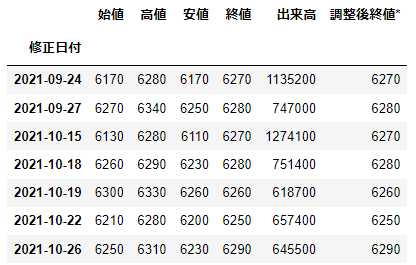
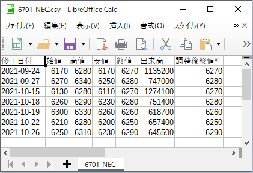

# NEC(6701)株価情報
NEC(6701)の [**HP**](https://finance.yahoo.co.jp/quote/6701.T/history) の株価情報を条件指定で抽出後にCSV出力、その後にCSVファイルからデータ読込

<br>

## 終値が6250以上、6300未満のデータ表示
```
main[(main['終値'] >= 6250) & (main['終値'] < 6300)]
```


<br>

## 終値が6250以上、6300未満のデータをCSV出力
```
main[(main['終値'] >= 6250) & (main['終値'] < 6300)].to_csv(r'C:\\Users\\Owner\\Pandas-Exercises4\\6701_NEC.csv')
```


<br>

## CSVファイルからデータ読込
```
reader = pd.read_csv(r'C:\\Users\\Owner\\Pandas-Exercises4\\6701_NEC.csv', index_col=['修正日付'])
```

<br>

## 読込データ表示
```
reader
```

